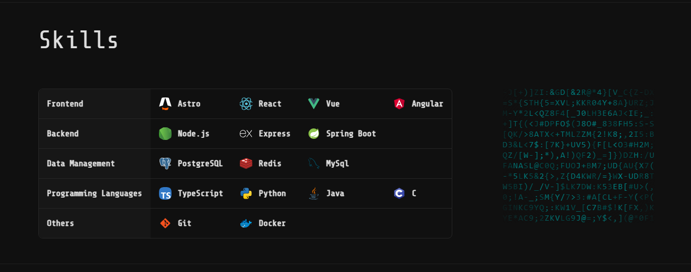

# Portfolio

---

[Demo](https:/gledrian.dev)

The template was taken from [Gothsec](https://github.com/Gothsec/Portfolio)

The component `<LetterGlitch \>` was taken from [ReactBits.dev](https://www.reactbits.dev/)

## **Stack**

### **Frontend**

### **Tools**

